# VibeCheck - Orchestration & Development Plan

## 1. System Orchestration (The "Vibe" Loop)

This diagram describes how data flows through the system in real-time.

```mermaid
sequenceDiagram
    participant User
    participant Ext as 🦊 Firefox Extension
    participant BE as 🧠 NestJS Backend
    participant Gem as ✨ Gemini Multimodal
    participant Worker as 🏭 BullMQ Worker
    participant PW as 🎭 Playwright Engine

    Note over User, Ext: Phase 1: Authentication & Setup
    User->>Ext: Opens Extension
    Ext->>Ext: Check Cookies for Dashboard Session
    Ext->>BE: Auth Handshake (Get User Projects)
    User->>Ext: Selects "Active Project" & Starts Session

    Note over User, Ext: Phase 2: Observation (Optimized)
    User->>Ext: Browses Target Website
    Ext->>Ext: Buffers `rrweb` DOM Events (Last 2 mins)
    Ext->>Ext: Buffers High-Res Video (Last 2 mins)
    Ext->>BE: Streams Audio (Continuous)
    Ext->>BE: Streams Low-FPS Screenshots (1 FPS)
    
    Note over BE, Gem: Phase 3: Analysis (Realtime)
    BE->>Gem: Pipes Audio + Screenshots
    Gem-->>BE: "User looks frustrated" OR "Intent: Bug Flagged"
    BE-->>Ext: Audio Response ("Need help?" / "Bug Logged")
    
    Note over Ext, Worker: Phase 4: Capture & Reproduction
    User->>Ext: "Yeah, this button is broken!" (Voice Trigger)
    Ext->>BE: Uploads "Hurdle Packet" { rrweb_log, video_buffer, transcript }
    BE->>Worker: Enqueues Job
    
    Note over Worker, PW: Phase 5: Synthesis (Async)
    Worker->>Gem: "Analyze rrweb + transcript -> Generate Playwright"
    Gem-->>Worker: Returns reproduction_script.ts
    Worker->>PW: Executes reproduction_script.ts
    PW-->>Worker: Result (Pass/Fail)
```

---

## 2. Module Breakdown & Developer Assignment

To maximize speed, we split the project into two parallel tracks.

### 👤 Track A: The "Eyes" (Frontend & Browser Integration) - noureldeenay
**Focus:** Browser APIs, UI, Media Capture.
**Component:** `extension/`

1.  **Auth & Companion UI**
    *   Implement **Shared Authentication**: Read dashboard cookies to auto-login.
    *   UI States: `Idle` | `Connecting` | `Listening` | `Hurdle Uploading`.
    *   Project Selection Dropdown.

2.  **The "Recorder" Engine**
    *   **Context Capture**: Implement `rrweb` circular buffer (keep last ~5000 events).
    *   **Visual Capture**: Implement `MediaRecorder` logic.
        *   **Stream A (AI)**: Low FPS (or periodic screenshots) canvas extraction.
        *   **Stream B (Evidence)**: High Quality video buffer.
    
3.  **Real-time Interaction**
    *   Setup `socket.io-client` for bi-directional audio/command streaming.
    *   Audio Visualization (Canvas) so user knows when Gemini is "listening".

### 🛠️ Track B: The "Brain" (Backend & Infrastructure) - mohikel
**Focus:** Server logic, AI integration, Job Queues.
**Component:** `backend/` & `frontend/` (Dashboard)

1.  **Real-time Gateway (NestJS)**
    *   Setup `Gateway` with Socket.io.
    *   **Gemini Proxy Optimization**: 
        *   Throttling video frames sent to Gemini API to save tokens.
        *   Maintaining the open WebSocket session with Gemini Live.

2.  **The "Factory" (Async Workers)**
    *   Setup **BullMQ** to process the heavy "Hurdle Packets".
    *   **Code Generation Pipeline**:
        *   Input: `rrweb` events (JSON) + User Voice Transcript.
        *   Output: `Playwright` test script.
    *   **Execution**: Run the generated test in a sandboxed Docker container.

3.  **Dashboard & Integrations**
    *   **Octokit Integration**: Auto-create GitHub issues from the worker results.
    *   **Session Player**: A player that allows replaying the `rrweb` session + synced Audio.

---

## 3. Joint Integration Points
*   **The "Hurdle" Packet**:
    *   `{ events: rrweb.event[], videoChunk: Blob, audioChunk: Blob, aiContext: string }`
*   **Socket Protocol**:
    *   `client -> server`: `audio_data`, `video_frame` (throttled), `trigger_bug`
    *   `server -> client`: `ai_voice_chunk`, `status_update`
