# VibeCheck - Orchestration & Development Plan

## 1. System Orchestration (The "Vibe" Loop)

This diagram describes how data flows through the system in real-time.

```mermaid
sequenceDiagram
    participant User
    participant Ext as 🦊 Firefox Extension
    participant BE as 🧠 NestJS Backend
    participant Gem as ✨ Gemini Live API
    participant Worker as 🏭 BullMQ Worker
    participant PW as 🎭 Playwright Engine

    Note over User, Ext: Phase 1: Observation
    User->>Ext: Browses Target Website
    Ext->>Ext: Captures DOM (rrweb) + A/V (MediaRecorder)
    Ext->>BE: Streams Binary Data (Socket.io)
    
    Note over BE, Gem: Phase 2: Analysis (Realtime)
    BE->>Gem: Pipes A/V Stream
    Gem-->>BE: "User looks frustrated" (Event)
    BE-->>Ext: Audio Response ("Need help?")
    
    Note over Ext, Worker: Phase 3: Intervention & Capture
    User->>Ext: "Yeah, this button is broken!"
    Ext->>BE: Sends "Hurdle Detected" Signal
    BE->>Worker: Enqueues Job { rrweb_log, video_buffer, transcript }
    
    Note over Worker, PW: Phase 4: Reproduction (Async)
    Worker->>Gem: "Analyze this logs & generate Playwright script"
    Gem-->>Worker: Returns code.ts
    Worker->>PW: Executes code.ts
    PW-->>Worker: Result (Pass/Fail)
```

---

## 2. Module Breakdown & Developer Assignment

To maximize speed, we split the project into two parallel tracks.

### 👤 Track A: The "Eyes" (Frontend & Browser Integration) - noureldeenay
**Focus:** Browser APIs, UI, Media Capture.
**Component:** `extension/`

1.  **Sidebar UI Implementation**
    *   Build the React UI for the Firefox Sidebar.
    *   States: `Idle` | `Connecting` | `Listening` | `Hurdle Detected`.
    *   Microphone/Speaker toggles and visualization (Canvas audio visualizer).

2.  **The "Recorder" Engine**
    *   Implement **`rrweb`** record function injected into the active tab's content script.
    *   Implement **`MediaRecorder`** logic to capture the active tab's video stream.
    *   Buffer management: Keep the last 2 minutes of data in memory (circular buffer) to send when a bug is found.

3.  **Real-time Streaming Client**
    *   Setup `socket.io-client` in the extension background script.
    *   Handle binary streaming of audio chunks to the backend.
    *   Handle playing back audio chunks received from the backend (PCM -> AudioContext).

### 🛠️ Track B: The "Brain" (Backend & Infrastructure) - mohikel
**Focus:** Server logic, AI integration, Job Queues.
**Component:** `backend/` & `frontend/` (Dashboard)

1.  **Real-time Gateway (NestJS)**
    *   Setup `Gateway` with Socket.io.
    *   Implement **Gemini Multimodal Live API** proxy:
        *   Receive user audio/video -> Pipe to Gemini.
        *   Receive Gemini audio -> Pipe to Extension.
    *   Prompt System: Inject the "VibeCheck Personality" system prompt.

2.  **The "Factory" (Async Workers)**
    *   Setup **BullMQ (Redis)** to handle "Hurdle Jobs".
    *   **Prompt Engineering**: Create the prompts (in `prompts/analysis`) that take `rrweb` JSON and output Playwright code.
    *   **Execution Engine**: Create a service that writes the string code to a file and executes it using `npx playwright test`.

3.  **Dashboard & Integrations**
    *   Build the *Next.js Dashboard* (`frontend/`) to list past sessions.
    *   Integrate **GitHub API** (Octokit) to create issues with the reproduction video/script attached.

---

## 3. Joint Integration Points
*   **The "Hurdle" Packet**: Agree on the exact JSON structure sent when a bug is found.
    *   `{ timestamp: number, dom_events: Event[], video_blob: Blob, transcript: string }`
*   **Socket Events**: Define the event names (`audio_chunk`, `ai_response`, `trigger_report`).
